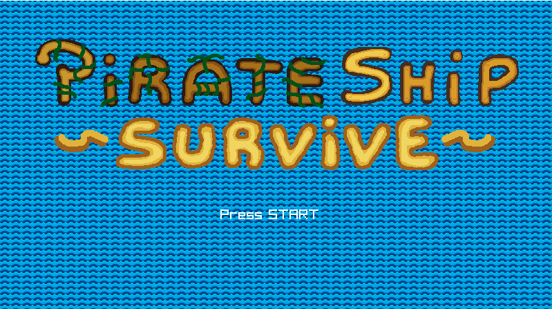
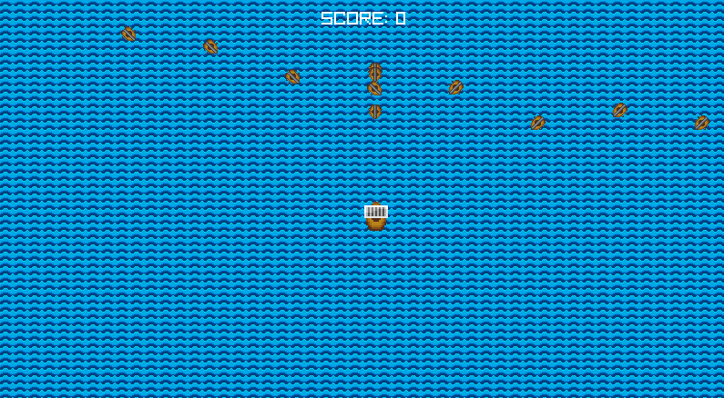

# PirateShip-Survive
Is a minigame making in Raylib and Ported to HTML5 using Emscripten, I created this game in order to practice my knowledge in Raylib and other libraries, the code is organized, however it can be improved in case you want to create something even better or a game similar to this one.

 

## Dependencias
Raylib: https://www.raylib.com/
Emscripten: https://emscripten.org/
